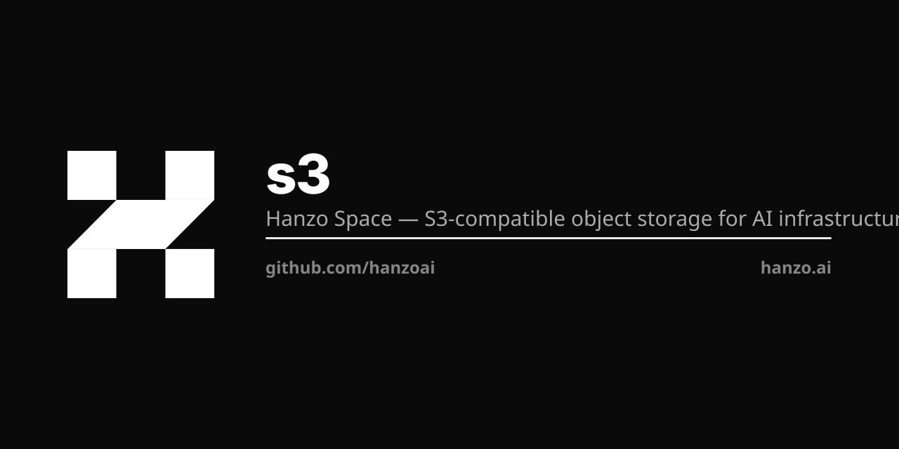

<p align="center"></p>

# Hanzo S3

Hanzo S3 is S3-compatible distributed object storage: a master, volume servers, a filer and
an S3 gateway, all in one Go binary called `s3`.

## Install

Every release is an image, tagged `v<X.Y.Z>`:

```bash
docker pull ghcr.io/hanzoai/s3:v1.0.24
```

Or build the `s3` binary from a clone:

```bash
git clone https://git.hanzo.ai/hanzoai/s3
cd s3 && go build -o s3 ./s3
```

`go install github.com/hanzoai/s3/s3@latest` will not work. This tree replaces
`github.com/tyler-smith/go-bip39`, whose upstream repository was deleted, and Go refuses
replace directives when installing at a version.

On macOS, if a downloaded binary is quarantined: `xattr -d com.apple.quarantine ./s3`.

## First run

`s3 mini` brings up the whole stack — master, volume, filer, S3 gateway — with credentials
and a bucket already created:

```bash
AWS_ACCESS_KEY_ID=admin \
AWS_SECRET_ACCESS_KEY=secret \
S3_BUCKET=my-bucket \
s3 mini -dir=/data
```

The same run in Docker:

```bash
docker run -p 8333:8333 \
  -e AWS_ACCESS_KEY_ID=admin \
  -e AWS_SECRET_ACCESS_KEY=secret \
  -e S3_BUCKET=my-bucket \
  ghcr.io/hanzoai/s3
```

Point any S3 client at it:

```python
import boto3

s3 = boto3.client(
    "s3", endpoint_url="http://localhost:8333",
    aws_access_key_id="admin", aws_secret_access_key="secret",
    region_name="us-east-1",
)
s3.put_object(Bucket="my-bucket", Key="hello.txt", Body=b"hi")
print(s3.get_object(Bucket="my-bucket", Key="hello.txt")["Body"].read())
```

What `s3 mini` starts:

| Service | Address |
| --- | --- |
| S3 endpoint | http://localhost:8333 |
| Master UI | http://localhost:9333 |
| Volume server | http://localhost:9340 |
| Filer UI | http://localhost:8888 |
| WebDAV | http://localhost:7333 |
| Iceberg REST catalog | http://localhost:8181 |
| Admin UI | http://localhost:23646 |

`S3_BUCKET` takes a comma-separated list. `S3_TABLE_BUCKET` creates S3 Tables (Iceberg)
buckets. Leave the AWS keys out and the S3 gateway runs unauthenticated, which is fine for
local development and nothing else.

## Running it for real

`s3 mini` is one process for convenience. In a cluster you run the components separately:

```bash
s3 master -mdir=/data/master
s3 volume -dir=/data/vol1 -master=<master_host>:9333 -port=8081
s3 filer  -master=<master_host>:9333
s3 s3     -filer=<filer_host>:8888 -port=8333
```

Add volume servers to add capacity — each one registers with the master and starts taking
writes. `s3 -h` lists every command; `s3 <command> -h` lists its flags. `s3 scaffold`
writes starter config files.

## Console

`s3 admin` serves the web console on port 23646 — cluster topology, volume and collection
management, a file browser, users, policies and service accounts, and scheduled maintenance:

```bash
s3 admin -master=<master_host>:9333 -adminPassword=<password> -dataDir=/var/lib/s3-admin
```

Leave `-adminPassword` unset and the console runs with no authentication, so set one
anywhere it is reachable. `-readOnlyUser`/`-readOnlyPassword` add a view-only account.
`-dataDir` persists console configuration and maintenance state across restarts.

For administration from a terminal, `s3 shell` is an interactive shell over the same
cluster: buckets and their lifecycle, quota, versioning and object lock; IAM users, groups,
policies, access keys and service accounts; volumes, erasure coding, the filer tree and
remote tiering. `help` lists them all.

Beyond the S3 API, the filer gives you POSIX-shaped directories over HTTP, FUSE mounting
(`s3 mount`), WebDAV, cross-cluster replication (`s3 filer.sync`), tiering to remote object
stores, erasure coding for warm data, and a built-in Iceberg REST catalog so Spark, Trino,
DuckDB and friends can read tables without a separate metastore. Kubernetes manifests are
in [`k8s/`](k8s/), Docker Compose files in [`docker/`](docker/).

## Clients

Any S3 client works. Ours for Go is [`hanzoai/s3-go`](https://github.com/hanzoai/s3-go),
module `github.com/hanzos3/go`. This repository is the server.

## One name

The product is **Hanzo S3**. `hanzoai/storage` and `hanzoai/storage-go` are old paths that
redirect here and to `hanzoai/s3-go` — renames, not separate products. "Hanzo Storage"
anywhere in our copy is stale, not a second thing.

## Docs

[`LLM.md`](LLM.md) in this repository is the deep reference: architecture, the filer
metadata store, the ZAP transport, and how S3 fits the rest of the platform.
[docs.hanzo.ai](https://docs.hanzo.ai/docs) covers the platform around it.

## Lineage

Hanzo S3 is a fork of [SeaweedFS](https://github.com/seaweedfs/seaweedfs) at its 4.34
release series, Apache-2.0, copyright Chris Lu — see [`NOTICE`](NOTICE). The upstream
binary is `weed`; ours is `s3`, and every import path is `github.com/hanzoai/s3`. The
storage design it inherits comes from Facebook's Haystack paper, with erasure coding after
f4. Two support libraries are forked alongside it, each keeping its own upstream licence:
`hanzoai/goexif` (BSD-2-Clause) and `hanzoai/go-fuse` (BSD-3-Clause).

## License

Apache-2.0 — see [LICENSE](LICENSE).
